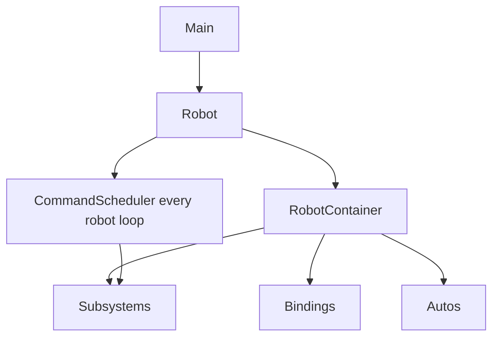

# Project anatomy

A robot project should make ownership easy to follow. Exact package names vary, but the responsibilities should remain recognizable.

```text
src/main/java/frc/robot/
├── Robot.java              framework lifecycle
├── RobotContainer.java     subsystem construction and bindings
├── commands/               reusable robot actions
├── subsystems/             system behavior and hardware boundaries
├── config/                 IDs, geometry, limits, and gains
├── autos/                  autonomous composition
├── controls/               driver and operator mappings
├── safety/                 shared faults and operating constraints
└── telemetry/              logs, alerts, and operator status
```

## Startup path

WPILib starts `Main`, constructs `Robot`, and calls lifecycle methods. `RobotContainer` normally constructs long-lived subsystems and connects controller inputs to commands.



## Where a change belongs

- A CAN ID or gear ratio belongs in configuration.
- Reading a motor controller belongs in a hardware adapter or subsystem IO layer.
- Deciding whether a mechanism may move belongs in the subsystem or coordinator.
- Mapping a controller button belongs in controls or `RobotContainer`.
- Sequencing several capabilities belongs in a command or superstructure.
- Reporting why an action was blocked belongs in telemetry and the responsible logic.

## Trace behavior in both directions

From intent to hardware: binding → command → subsystem API → controller → IO.

From a failure to intent: sensor/log → IO snapshot → subsystem state → active command → triggering condition.

If one file performs every step, the architecture is hiding responsibilities rather than removing them.
